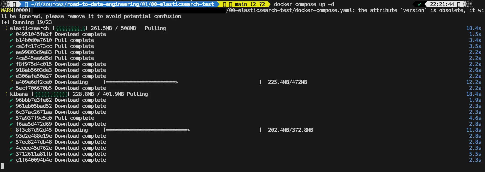
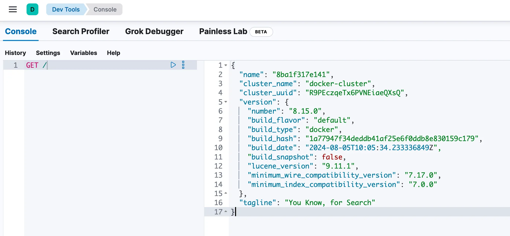

## 2.1 전체 구성 개요

| 구성요소       | 역할                          | 포트 | 설명            |
| -------------- | ----------------------------- | ---- | --------------- |
| Elasticsearch  | 핵심 데이터 저장 및 검색 엔진 | 9200 | REST API 포트   |
| Kibana         | 시각화, Dev Tools 콘솔        | 5601 | 웹 대시보드     |
| Postman / curl | REST API 테스트               | -    | 클라이언트 도구 |

구조 요약:

```
[Postman or curl] → [Kibana Dev Tools] → [Elasticsearch Container]
```

## 2.2 사전 준비

### ✅ 필수 설치 목록

- Docker & Docker Compose
- 포트 9200, 5601 개방 확인 (로컬 충돌 방지)
- RAM 최소 4GB 이상 (Elasticsearch 컨테이너가 메모리를 많이 사용)

## 2.3 Docker로 Elasticsearch 설치

### 📁 디렉토리 구조

```
00-elasticsearch-test/
 ├── docker-compose.yml
 └── data/
```

### 🧾 docker-compose.yml 예시

```yaml
version: "3.8"

services:
  elasticsearch:
    image: docker.elastic.co/elasticsearch/elasticsearch:8.15.0
    container_name: elasticsearch
    environment:
      - discovery.type=single-node
      - xpack.security.enabled=false
      - ES_JAVA_OPTS=-Xms1g -Xmx1g
    ports:
      - "9200:9200"
    volumes:
      - ./data:/usr/share/elasticsearch/data

  kibana:
    image: docker.elastic.co/kibana/kibana:8.15.0
    container_name: kibana
    ports:
      - "5601:5601"
    environment:
      - ELASTICSEARCH_HOSTS=http://elasticsearch:9200
    depends_on:
      - elasticsearch
```

💡 **Tip**

> 보안 모듈(xpack.security)을 꺼서 학습 환경을 단순화했습니다.실제 운영 환경에서는 사용자 인증 및 TLS 설정이 필요합니다.

### 🚀 실행 명령어

```bash
docker compose up -d
docker ps
```



## 2.4 정상 동작 확인

### 🧩 Elasticsearch REST API 테스트

```bash
curl -X GET "<http://localhost:9200>"
```

응답 결과 :

```json
{
  "name" : "8ba1f317e141",
  "cluster_name" : "docker-cluster",
  "cluster_uuid" : "R9PEczqeTx6PVNEiaeQXsQ",
  "version" : {
    "number" : "8.15.0",
    "build_flavor" : "default",
    "build_type" : "docker",
    "build_hash" : "1a77947f34deddb41af25e6f0ddb8e830159c179",
    "build_date" : "2024-08-05T10:05:34.233336849Z",
    "build_snapshot" : false,
    "lucene_version" : "9.11.1",
    "minimum_wire_compatibility_version" : "7.17.0",
    "minimum_index_compatibility_version" : "7.0.0"
  },
  "tagline" : "You Know, for Search"
}
```

그리고 Kibana까지 정상적으로 올라왔다.

## 2.5 Kibana 접속 및 활용

- 브라우저에서 접속: 👉 http://localhost:5601
- 좌측 메뉴 → **Dev Tools** 선택
- Kibana 콘솔에서 다음 명령 실행:

```bash
GET /
```



### ✨ Kibana로 할 수 있는 것

- Elasticsearch API 테스트 (Dev Tools 콘솔)
- 인덱스 생성 및 데이터 검색
- 대시보드 시각화 (추후 단계에서 활용)

------

## 2.6 Postman 또는 curl을 이용한 API 테스트

### 🧰 선택 1. Postman

- 새 요청 생성 → `GET http://localhost:9200`
- 응답이 JSON으로 표시되면 연결 성공
- 이후 CRUD 요청(`PUT`, `GET`, `POST`, `DELETE`)으로 실습 가능

```jsx
PUT <http://localhost:9200/products/_doc/1>
Content-Type: application/json

{
  "name": "고양이 사료",
  "price": 12000
}
```

#### Postman 테스트 결과

- GET / 

```http
GET http://localhost:9200/
```
```json
{
    "name": "8ba1f317e141",
    "cluster_name": "docker-cluster",
    "cluster_uuid": "R9PEczqeTx6PVNEiaeQXsQ",
    "version": {
        "number": "8.15.0",
        "build_flavor": "default",
        "build_type": "docker",
        "build_hash": "1a77947f34deddb41af25e6f0ddb8e830159c179",
        "build_date": "2024-08-05T10:05:34.233336849Z",
        "build_snapshot": false,
        "lucene_version": "9.11.1",
        "minimum_wire_compatibility_version": "7.17.0",
        "minimum_index_compatibility_version": "7.0.0"
    },
    "tagline": "You Know, for Search"
}
```

- PUT /products/\_doc/1

```http
PUT localhost:9200/products/_doc/1
{
  "name": "고양이 사료",
  "price": 12000
}
```
```json
{
    "_index": "products",
    "_id": "1",
    "_version": 5,
    "result": "updated",
    "_shards": {
        "total": 2,
        "successful": 1,
        "failed": 0
    },
    "_seq_no": 4,
    "_primary_term": 1
}
```

- GET /products/\_search?pretty
```http
GET /products/_search?pretty
{
    "query": {
      "match": {
        "name": "고양이"
      }
    }
}
```
```json
{
    "took": 2,
    "timed_out": false,
    "_shards": {
        "total": 1,
        "successful": 1,
        "skipped": 0,
        "failed": 0
    },
    "hits": {
        "total": {
            "value": 1,
            "relation": "eq"
        },
        "max_score": 0.13353139,
        "hits": [
            {
                "_index": "products",
                "_id": "1",
                "_score": 0.13353139,
                "_source": {
                    "name": "고양이 사료",
                    "price": 12000
                }
            }
        ]
    }
}
```