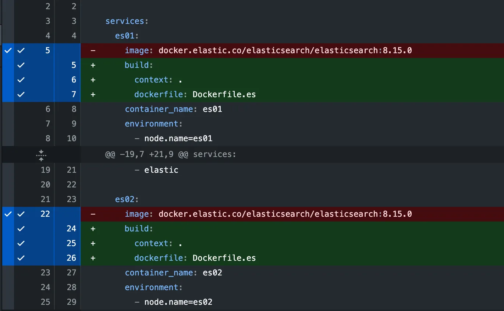
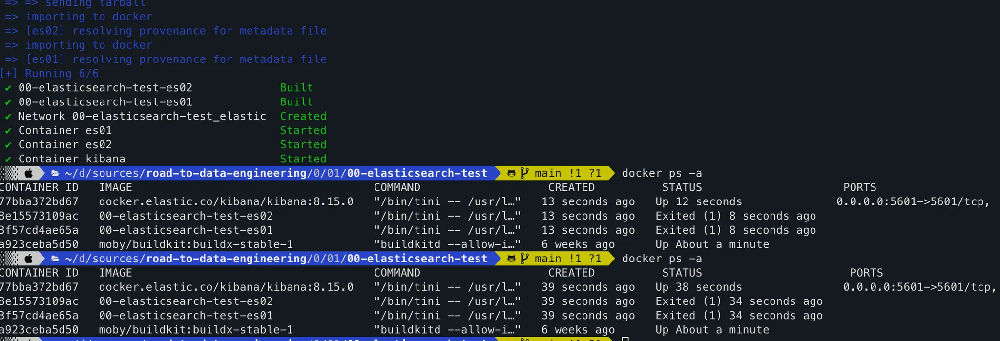

# 03. 매핑과 분석기

## 🧩 1. 매핑(Mapping)의 개념 이해

### 💡 개념

- Elasticsearch에서 **Mapping**은 **인덱스 내 문서의 필드 타입과 색인 방식 정의**를 말함.
- 즉, **스키마(schema)** 역할을 한다고 볼 수 있다.

### ⚙️ 매핑의 종류

| 종류             | 설명                              | 예시                                             |
| ---------------- | --------------------------------- | ------------------------------------------------ |
| Dynamic Mapping  | 데이터 색인 시 자동으로 타입 추론 | 처음엔 편하지만, 의도치 않은 매핑이 생길 수 있음 |
| Explicit Mapping | 개발자가 직접 매핑 정의           | 실무에선 필수 (특히 text vs keyword 구분)        |

### 🔍 Dynamic Mapping 예시

```json
PUT /movies_auto/_doc/1
{
  "title": "기생충",
  "rating": 8.6,
  "release_date": "2019-05-30"
}
```

→ Elasticsearch는 자동으로 다음과 같은 매핑을 생성함:

```json
{
  "title":       { "type": "text" },
  "rating":      { "type": "float" },
  "release_date":{ "type": "date" }
}
```

**장점**: 빠른 프로토타이핑

**단점**: 예기치 않은 타입 생성 (특히 숫자/문자 혼용 시)

### 🔧 Explicit Mapping 예시

```json
PUT /movies_explicit
{
  "mappings": {
    "properties": {
      "title": { "type": "text", "analyzer": "nori" },
      "title_keyword": { "type": "keyword" },
      "rating": { "type": "float" },
      "release_date": { "type": "date" },
      "genres": { "type": "keyword" }
    }
  }
}
```

→ 의도대로 `title`은 검색용, `title_keyword`는 정렬/필터용으로 분리 가능.

## 🧮 2. 데이터 타입 이해

Elasticsearch는 RDBMS보다 더 다양한 타입을 제공한다.

주요 필드 타입을 정리하면 다음과 같다 👇

| 타입                         | 설명                          | 비고                      |
| ---------------------------- | ----------------------------- | ------------------------- |
| `text`                       | 형태소 분석 적용, 검색용      | Full-text 검색            |
| `keyword`                    | 원문 그대로 저장, 정렬/필터용 | Exact match용             |
| `date`                       | 날짜 타입 (ISO 형식)          | yyyy-MM-dd 등             |
| `integer`, `float`, `double` | 수치형                        | 범위 검색, 정렬           |
| `boolean`                    | true/false                    |                           |
| `nested`                     | 배열 내 객체 검색             | 출연진 등 복합 구조       |
| `object`                     | JSON 객체 저장                | 분석 불가 (그룹형 데이터) |
| `dense_vector`               | 벡터 검색용                   | AI/LLM 연동 시 사용       |

### ❓의문점

`nested`와 `object` 타입에 대한 구체적인 차이점이 궁금해졌다. 이는 다른 페이지에서 다룬다. → [ES 타입 비교 - nested와 object](https://www.notion.so/ES-nested-object-28e7032acc73802583a1c5876dd83e17?pvs=21)

## 🧠 3. 분석기(Analyzer)의 개념과 구성 요소

### 💡 분석기의 역할

Analyzer는 **텍스트를 토큰(token)** 단위로 쪼개서 색인/검색 시 일관성 있게 처리하기 위한 모듈이다.

→ 검색어와 문서를 같은 방식으로 분석해야 **정확한 검색이 가능**하다.

### 🧱 구성 요소

| 구성요소    | 역할                    | 예시                                       |
| ----------- | ----------------------- | ------------------------------------------ |
| Tokenizer   | 문장을 단어 단위로 분리 | `standard`, `nori_tokenizer`, `whitespace` |
| Filter      | 토큰을 후처리           | `lowercase`, `stop`, `synonym`             |
| Char Filter | 텍스트 전처리           | HTML 제거, 특정 문자 치환                  |

## 🇰🇷 4. 한글 형태소 분석기: Nori

한국어는 띄어쓰기만으로 단어를 정확히 구분하기 어렵기 때문에, Elasticsearch에서는 **Nori Analyzer**를 사용한다.

### 🧩 기본 설정 예시

```json
PUT /korean_test
{
  "settings": {
    "analysis": {
      "analyzer": {
        "korean_analyzer": {
          "type": "custom",
          "tokenizer": "nori_tokenizer",
          "filter": ["lowercase"]
        }
      }
    }
  },
  "mappings": {
    "properties": {
      "title": { "type": "text", "analyzer": "korean_analyzer" }
    }
  }
}
```

---

### 🚨 트러블슈팅

`chatGPT`의 가이드에 따라 학습을 진행하던 도중 문제가 발생했다. `Kibana` dev tools에서 위 설정 요청을 보냈는데 다음과 같은 오류가 발생했다.

```json
{
  "error": {
    "root_cause": [
      {
        "type": "illegal_argument_exception",
        "reason": "Custom Analyzer [korean_analyzer] failed to find tokenizer under name [nori_tokenizer]"
      }
    ],
    "type": "illegal_argument_exception",
    "reason": "Custom Analyzer [korean_analyzer] failed to find tokenizer under name [nori_tokenizer]"
  },
  "status": 400
}
```

뭐 사실 약간 예상하긴 했다. 갑자기 한글 분석이 가능할 리가 없잖아? 이걸 `gemini`에게 물어보니, `nori_tokenizer`는 플러그인이며 이를 설치해야 한다는 답변이다. (그럼 그렇지)

바로 진행시켜. 먼저 플러그인을 설치하기 위해 `Dockerfile.es`를 작성한다.

```docker
# 사용할 Elasticsearch 공식 이미지를 베이스로 지정합니다.
# 예시로 8.14.0 버전을 사용합니다. 버전을 일치시켜주세요.
ARG ELASTIC_VERSION=8.14.0
FROM docker.elastic.co/elasticsearch/elasticsearch:${ELASTIC_VERSION}

# Nori 플러그인 설치
# --batch 옵션으로 사용자 상호작용 없이 설치를 진행합니다.
RUN /usr/share/elasticsearch/bin/elasticsearch-plugin install --batch analysis-nori
```

그리고 다음과 같이 docker-compose 파일을 수정한다.



이제 `elasticsearch`를 다시 실행하자.

```bash
docker compose down
...
docker compose up -d
(build가 진행된다)
...
```

그러나 예상과 달리 es가 제대로 올라오지 않았다.



원인을 분석하니 `Kibana`의 버전인 `8.15.0`과 맞지 않았던 것이다. (허탈)

> cannot downgrade a node from version [8.15.0] to version [8.14.0]

이제 보니, `Dockerfile.es`에 버전이 `8.14.0`이었다. 빠르게 수정 후 다시 테스트하자. 참고로 다시 빌드해야 하므로 `--build` 옵션을 추가하자

```bash
docker compose down
...
docker compose up -d --build
...
docker compose ps
NAME      IMAGE                                    COMMAND                   SERVICE   CREATED              STATUS              PORTS
es01      00-elasticsearch-test-es01               "/bin/tini -- /usr/l…"   es01      About a minute ago   Up About a minute   0.0.0.0:9200->9200/tcp, [::]:9200->9200/tcp
es02      00-elasticsearch-test-es02               "/bin/tini -- /usr/l…"   es02      About a minute ago   Up About a minute   0.0.0.0:9201->9200/tcp, [::]:9201->9200/tcp
kibana    docker.elastic.co/kibana/kibana:8.15.0   "/bin/tini -- /usr/l…"   kibana    About a minute ago   Up About a minute   0.0.0.0:5601->5601/tcp, [::]:5601->5601/tcp
```

그리고 다시 원래 하려던 요청을 진행하니 성공했다. 🎉

```json
PUT /korean_test
{
  "settings": {
    "analysis": {
      "analyzer": {
        "korean_analyzer": {
          "type": "custom",
          "tokenizer": "nori_tokenizer",
          "filter": ["lowercase"]
        }
      }
    }
  },
  "mappings": {
    "properties": {
      "title": { "type": "text", "analyzer": "korean_analyzer" }
    }
  }
}
{
  "acknowledged": true,
  "shards_acknowledged": true,
  "index": "korean_test"
}
```

---

### 🔬 테스트

```json
POST /korean_test/_analyze
{
  "analyzer": "korean_analyzer",
  "text": "고양이가 창가에 앉아 있다"
}
{
  "tokens": [
    {
      "token": "고양이",
      "start_offset": 0,
      "end_offset": 3,
      "type": "word",
      "position": 0
    },
    {
      "token": "가",
      "start_offset": 3,
      "end_offset": 4,
      "type": "word",
      "position": 1
    },
    {
      "token": "창",
      "start_offset": 5,
      "end_offset": 6,
      "type": "word",
      "position": 2
    },
    {
      "token": "가",
      "start_offset": 6,
      "end_offset": 7,
      "type": "word",
      "position": 3
    },
    {
      "token": "에",
      "start_offset": 7,
      "end_offset": 8,
      "type": "word",
      "position": 4
    },
    {
      "token": "앉",
      "start_offset": 9,
      "end_offset": 10,
      "type": "word",
      "position": 5
    },
    {
      "token": "아",
      "start_offset": 10,
      "end_offset": 11,
      "type": "word",
      "position": 6
    },
    {
      "token": "있",
      "start_offset": 12,
      "end_offset": 13,
      "type": "word",
      "position": 7
    },
    {
      "token": "다",
      "start_offset": 13,
      "end_offset": 14,
      "type": "word",
      "position": 8
    }
  ]
}
```

> 형태소 단위로 잘 쪼개지는 걸 확인할 수 있음.

## ⚙️ 5. 커스텀 분석기(Custom Analyzer) 만들기

### 🧠 목표

Nori에 **불용어(stop words)** 와 **유의어(synonyms)** 필터를 추가해서 검색 품질 향상시키기.

```json
PUT /movie_custom_analyzer
{
  "settings": {
    "analysis": {
      "filter": {
        "my_stop": {
          "type": "stop",
          "stopwords": ["영화", "작품"]
        },
        "my_synonym": {
          "type": "synonym",
          "synonyms": ["어벤져스,엔드게임 => 어벤져스 엔드게임"]
        }
      },
      "analyzer": {
        "kr_custom": {
          "type": "custom",
          "tokenizer": "nori_tokenizer",
          "filter": ["lowercase", "my_stop", "my_synonym"]
        }
      }
    }
  },
  "mappings": {
    "properties": {
      "title": { "type": "text", "analyzer": "kr_custom" }
    }
  }
}
```

테스트:

```json
POST /movie_custom_analyzer/_analyze
{
  "analyzer": "kr_custom",
  "text": "어벤져스 엔드게임 영화"
}
```

→ “영화”는 제거되고, “어벤져스 엔드게임”이 하나의 토큰으로 유지됨.

실제 응답은 이렇다:

```json
{
  "tokens": [
    {
      "token": "어벤져스",
      "start_offset": 0,
      "end_offset": 4,
      "type": "SYNONYM",
      "position": 0
    },
    {
      "token": "엔드",
      "start_offset": 5,
      "end_offset": 7,
      "type": "SYNONYM",
      "position": 1
    },
    {
      "token": "어벤져스",
      "start_offset": 5,
      "end_offset": 7,
      "type": "SYNONYM",
      "position": 1
    },
    {
      "token": "게임",
      "start_offset": 7,
      "end_offset": 9,
      "type": "SYNONYM",
      "position": 2
    },
    {
      "token": "엔드",
      "start_offset": 7,
      "end_offset": 9,
      "type": "SYNONYM",
      "position": 2
    },
    {
      "token": "게임",
      "start_offset": 7,
      "end_offset": 9,
      "type": "SYNONYM",
      "position": 3
    }
  ]
}
```

### ❓ 의문점

커스텀 분석기와 불용어, 유의어가 무엇일까? 좀 더 자세히 알아보자 → [Elasticsearch 커스텀 분석기](https://www.notion.so/Elasticsearch-28e7032acc7380c3ab0beccd63c2498e?pvs=21)

## 🧪 6. 실습 아이디어

| 실습 주제                       | 내용                                                   |
| ------------------------------- | ------------------------------------------------------ |
| 🔹 Dynamic vs Explicit 매핑 비교 | 인덱스 두 개 생성 후 필드 자동/수동 매핑 차이 비교     |
| 🔹 text vs keyword 검색 차이     | 동일한 문자열 필드를 두 타입으로 만들어 검색 결과 비교 |
| 🔹 한글 형태소 분석              | Nori 기본 분석기 vs Custom Analyzer 토큰 결과 비교     |
| 🔹 불용어/유의어 사전 튜닝       | 특정 단어 검색 품질 향상 실험                          |
| 🔹 Analyzer + Mapping 조합 튜닝  | 영화 제목, 감독, 출연진 필드별 최적 분석기 조합 설계   |

## 🎓 7. 학습 포인트 요약

| 주제                | 핵심 포인트                                  |
| ------------------- | -------------------------------------------- |
| Mapping             | 문서 구조 정의, 타입 지정으로 검색 효율 제어 |
| Dynamic vs Explicit | 빠른 테스트 vs 안정적인 운영 선택            |
| Analyzer            | 검색 품질의 핵심: 토큰화, 필터링, 정규화     |
| Nori                | 한국어 형태소 분석을 위한 기본 도구          |
| Custom Analyzer     | 불용어·유의어·필터 조합으로 품질 향상        |