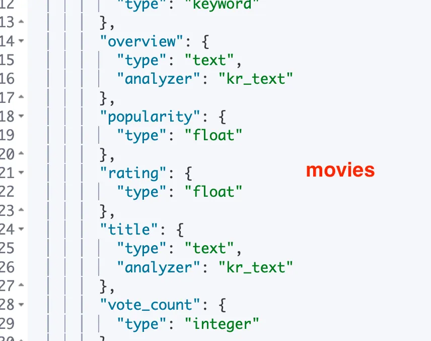
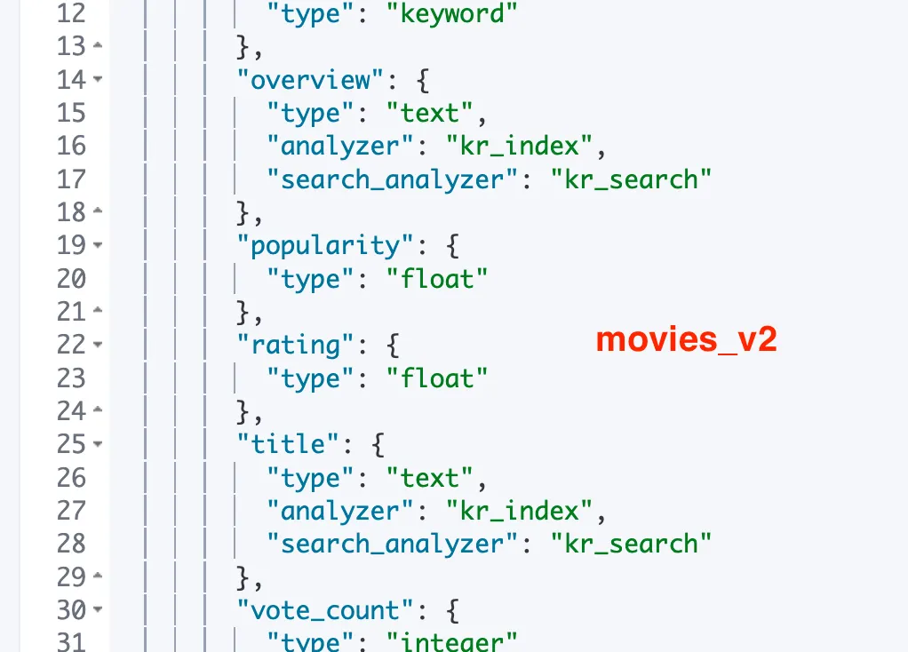

# Elasticsearch 재색인 방법

## 재색인

- movies → movies_v2로 재색인하여, stop 필터로 한국어 조사/불용어를 제거한다.
- 추가로 nori_part_of_speech로 품사 기반 필터링(조사 J 계열 등)을 적용한다.

아래는 **Kibana Dev Tools에서 그대로 실행**할 수 있는,

`movies` → `movies_v2` 재색인(리인덱스) + **무정지(alias 스위칭)** 가이드입니다.

> 목표
>
> 1. `movies_v2`를 새 매핑/분석기로 생성
> 2. `movies` 데이터를 `movies_v2`로 복사(Reindex)
> 3. 애플리케이션이 **항상 같은 이름**으로 접근할 수 있게 **별칭(alias)** 으로 전환
> 4. 검증 후, 이전 인덱스 정리(선택)

## **1) 현재 상태 점검**

```json
GET /_cat/indices/movies?v
GET /movies/_mapping
GET /movies/_count
```

## 2) 새 인덱스 `movies_v2` 생성 (커스텀 분석기 포함)

> 아래 설정은 조사/불용어 제거를 위한 예시입니다.

```json
PUT /movies_v2
{
  "settings": {
    "analysis": {
      "filter": {
        "kr_stop": {
          "type": "stop",
          "stopwords": ["의","이","가","은","는","을","를","에","에서","으로","로","과","와","도"]
        },
        "kr_pos_stop": {
          "type": "nori_part_of_speech",
          "stoptags": ["J"]     // 조사(Particles) 제거
        }
      },
      "analyzer": {
        "kr_index": {
          "type": "custom",
          "tokenizer": "nori_tokenizer",
          "filter": ["lowercase","kr_pos_stop","kr_stop"]
        },
        "kr_search": {
          "type": "custom",
          "tokenizer": "nori_tokenizer",
          "filter": ["lowercase","kr_pos_stop","kr_stop"]
        }
      }
    }
  },
  "mappings": {
    "properties": {
      "title":       { "type": "text", "analyzer": "kr_index", "search_analyzer": "kr_search" },
      "overview":    { "type": "text", "analyzer": "kr_index", "search_analyzer": "kr_search" },
      "genres":      { "type": "keyword" },
      "year":        { "type": "integer" },
      "rating":      { "type": "float" },
      "vote_count":  { "type": "integer" },
      "popularity":  { "type": "float" },
      "actors":      { "type": "keyword" },
      "directors":   { "type": "keyword" }
    }
  }
}
```

→ 생성 이후 토큰 확인해 보기 : 의도한 대로 “의”가 빠졌다. (성공 🎉)

```json
POST /movies_v2/_analyze
{
  "analyzer": "kr_search",
  "text": "꿈의 세계"
}
{
  "tokens": [
    {
      "token": "꿈",
      "start_offset": 0,
      "end_offset": 1,
      "type": "word",
      "position": 0
    },
    {
      "token": "세계",
      "start_offset": 3,
      "end_offset": 5,
      "type": "word",
      "position": 2
    }
  ]
}
```

## 3) 리인덱스 실행 (movies → movies_v2)

```json
POST /_reindex
{
  "source": {
    "index": "movies"
  },
  "dest": {
    "index": "movies_v2",
    "op_type": "create"           // 중복 _id 있으면 실패시키고 싶을 때
  }
}
```

> ⚠️ 충돌을 무시하고 계속 가려면 `op_type` 제거하고 `"conflicts":"proceed"`를 `source`에 추가하세요:

```json
"source": { "index": "movies", "conflicts": "proceed" }
```

→ reindex 결과

```json
{
  "took": 19,
  "timed_out": false,
  "total": 5,
  "updated": 0,
  "created": 5,
  "deleted": 0,
  "batches": 1,
  "version_conflicts": 0,
  "noops": 0,
  "retries": {
    "bulk": 0,
    "search": 0
  },
  "throttled_millis": 0,
  "requests_per_second": -1,
  "throttled_until_millis": 0,
  "failures": []
}
```

→ ✅ 진행 상황 확인 (대량 데이터일 때 유용, 현재는 워낙 적어서 바로 끝났기 때문에 데이터 안 나옴)

```json
GET /_tasks?detailed=true&actions=*reindex
```

## 4) 데이터 검증

```json
GET /movies/_search?size=5
GET /movies_v2/_search?size=5

GET /movies/_mapping
GET /movies_v2/_mapping
```

→ `_mapping` 결과를 보면 `overview`와 `title`의 `analyzer`, `search_analyzer`가 다르다.





## 5) 무정지 전환 전략 (Alias 스위칭)

현재 애플리케이션이 `movies` 라는 **인덱스 이름**을 직접 사용 중이면, 동일한 이름으로 **alias를 바로 만들 수 없습니다**(인덱스와 alias의 이름 충돌). 따라서 **안전한 2단계 전환**을 권장합니다.

### **옵션 A) 짧은 멈춤 허용 (간단)**

1. 앱 잠깐 정지 → `movies` 삭제 → 같은 이름의 alias 생성 → 앱 재기동

(아래 **옵션 B**가 더 권장됩니다)

### **옵션 B) 무정지(권장) – “읽기 별칭” 도입**

4-1) 현재 인덱스에 임시 별칭 부여 (앱이 별칭으로 읽게 전환)

```json
POST /_aliases
{
  "actions": [
    { "add": { "index": "movies",    "alias": "movies_read" } }
  ]
}
```

- 애플리케이션의 ES 설정에서 **인덱스 이름을 `movies_read`로 변경**
- (이 변경은 한 번만 하면, 앞으로도 계속 alias만 바꾸면 됨)

4-2) 새 인덱스로 별칭 원자적 스위칭

```json
POST /_aliases
{
  "actions": [
    { "remove": { "index": "movies",    "alias": "movies_read" } },
    { "add":    { "index": "movies_v2", "alias": "movies_read" } }
  ]
}
```

- 이 호출은 **원자적(atomic)** 이므로 무정지 전환 가능
- 이제 앱은 자동으로 `movies_v2`를 읽게 됨

> 참고: 쓰기 요청이 있다면 `movies_write` 별칭을 분리해 **R/W 분리 alias**로 운용하는 게 가장 안전합니다. (예: 읽기 `movies_read` / 쓰기 `movies_write` 를 각각 스위칭)

✅ 이제 movies_read 별칭으로 데이터 검색이 가능하다.

```json
GET /movies_read/_search?size=2
{
  "took": 1,
  "timed_out": false,
  "_shards": {
    "total": 1,
    "successful": 1,
    "skipped": 0,
    "failed": 0
  },
  "hits": {
    "total": {
      "value": 5,
      "relation": "eq"
    },
    "max_score": 1,
    "hits": [
      {
        "_index": "movies_v2",
        "_id": "1",
        "_score": 1,
        "_source": {
          "title": "어벤져스: 엔드게임",
          "overview": "사라진 모두를 되찾기 위한 마지막 전쟁.",
          "genres": [
            "Action",
            "Adventure",
            "Sci-Fi"
          ],
          "year": 2019,
          "rating": 8.4,
          "vote_count": 2500000,
          "popularity": 98.7,
          "actors": [
            "로버트 다우니 주니어",
            "크리스 에반스"
          ],
          "directors": [
            "안소니 루소",
            "조 루소"
          ]
        }
      },
      {
        "_index": "movies_v2",
        "_id": "2",
        "_score": 1,
        "_source": {
          "title": "인셉션",
          "overview": "꿈을 훔치는 도둑의 마지막 미션.",
          "genres": [
            "Action",
            "Sci-Fi",
            "Thriller"
          ],
          "year": 2010,
          "rating": 8.8,
          "vote_count": 2300000,
          "popularity": 92.1,
          "actors": [
            "레오나르도 디카프리오",
            "조셉 고든 레빗"
          ],
          "directors": [
            "크리스토퍼 놀란"
          ]
        }
      }
    ]
  }
}
```

## 6) (선택) 구 인덱스 정리 및 최종 alias 정비

### 6-1) 구 인덱스 삭제

```json
DELETE /movies
```

### 6-2) 원래 이름으로 alias 정착하고 싶다면

- 앱이 `movies_read`를 이미 사용 중이면 이 단계는 생략 가능
- 그래도 “원래 이름”으로 쓰고 싶다면:

```json
# movies 라는 alias를 새 인덱스에 부여
POST /_aliases
{
  "actions": [
    { "add": { "index": "movies_v2", "alias": "movies" } }
  ]
}
```

> 이제 앱에서는 `movies`(alias) 또는 `movies_read`(alias) 어느 쪽으로든 접근 가능. 장기적으로는 **항상 alias**를 쓰는 것을 권장합니다.

## 7) 기능 검증 (쿼리 테스트)

이제 다시 원래의 의도 대로 검색이 되는지 확인하자.

```json
GET /movies/_search
{
  "query": {
    "multi_match": {
      "query": "꿈의 세계",
      "fields": ["title^3","overview"]
    }
  }
}
```

→ 인셉션만 나온다 🎉

```json
{
  "took": 3,
  "timed_out": false,
  "_shards": {
    "total": 1,
    "successful": 1,
    "skipped": 0,
    "failed": 0
  },
  "hits": {
    "total": {
      "value": 1,
      "relation": "eq"
    },
    "max_score": 1.5697745,
    "hits": [
      {
        "_index": "movies_v2",
        "_id": "2",
        "_score": 1.5697745,
        "_source": {
          "title": "인셉션",
          "overview": "꿈을 훔치는 도둑의 마지막 미션.",
          "genres": [
            "Action",
            "Sci-Fi",
            "Thriller"
          ],
          "year": 2010,
          "rating": 8.8,
          "vote_count": 2300000,
          "popularity": 92.1,
          "actors": [
            "레오나르도 디카프리오",
            "조셉 고든 레빗"
          ],
          "directors": [
            "크리스토퍼 놀란"
          ]
        }
      }
    ]
  }
}
```
