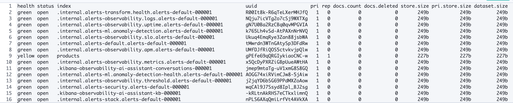
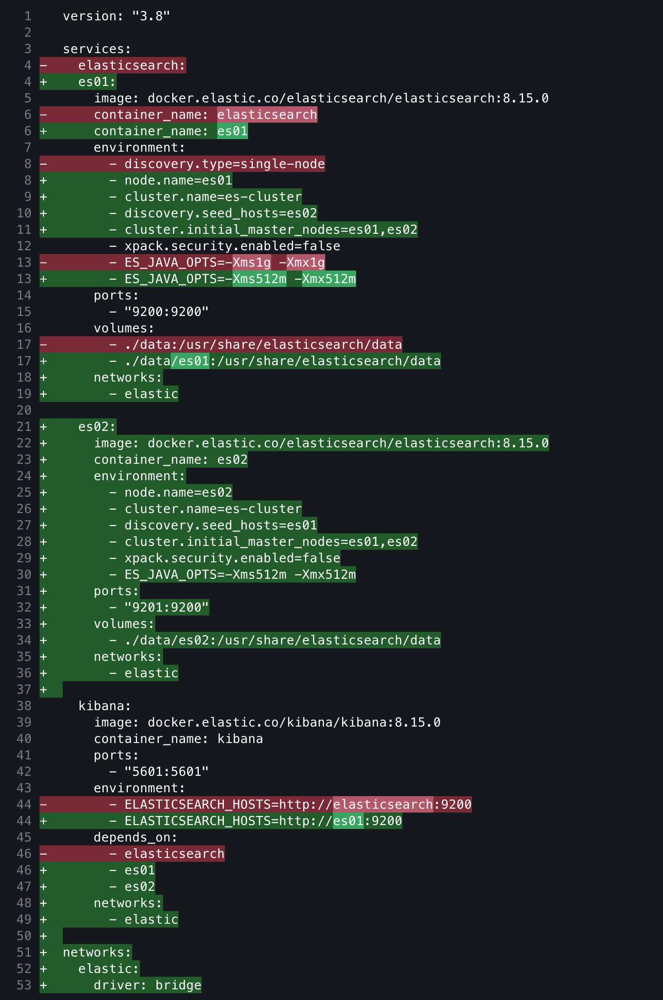
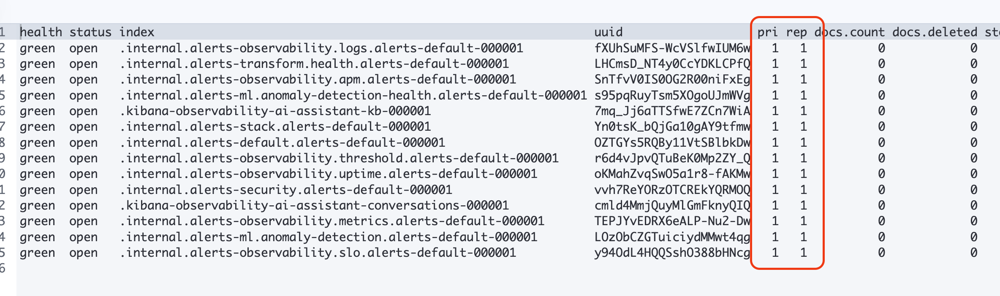
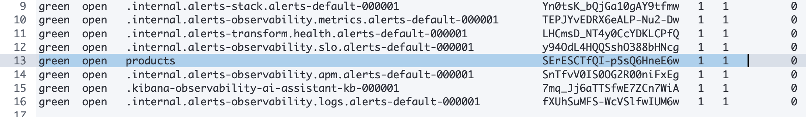

# 02. 색인 및 검색 실습


## 3.1 실습 개요

이 실습에서는 다음을 단계별로 수행합니다.

| 단계 | 학습 목표               | 사용 API                                          |
| ---- | ----------------------- | ------------------------------------------------- |
| 1️⃣    | 인덱스 생성, 확인, 삭제 | `PUT`, `GET`, `DELETE /{index}`                   |
| 2️⃣    | 문서 CRUD (단건)        | `PUT`, `GET`, `POST`, `DELETE /{index}/_doc/{id}` |
| 3️⃣    | 대량 데이터 입력        | `_bulk` API                                       |
| 4️⃣    | 기본 검색               | `_search` + `match`, `term`                       |
| 5️⃣    | 필터링 및 정렬          | `bool`, `filter`, `sort`                          |

## 3.2 인덱스 생성, 조회, 삭제

Elasticsearch에서 데이터를 저장하기 전에 **인덱스(index)** 를 만들어야 합니다.
RDBMS로 치면 “테이블 생성” 단계에 해당합니다.

### 인덱스 생성

요청 :

```json
PUT /products
{
  "mappings": {
    "properties": {
      "name": { "type": "text" },
      "brand": { "type": "keyword" },
      "price": { "type": "integer" },
      "in_stock": { "type": "boolean" },
      "created_at": { "type": "date" }
    }
  }
}
```

설명

- `text`: 형태소 분석이 필요한 필드 (검색용)
- `keyword`: 정렬·필터용 (정확한 일치 비교)
- `integer`, `boolean`, `date`: 숫자/논리/날짜 타입

응답 :

```json
{
  "acknowledged": true,
  "shards_acknowledged": true,
  "index": "products"
}
```

### 인덱스 목록 확인

```http
GET /_cat/indices?v
```



#### ❓ 의문점

위 결과를 보면 products 인덱스의 상태(health)가 yellow라고 출력되었다. 이는 왜일까? 그것은 pri/rep 속성을 보면 알 수 있는데, 1과 1으로 현재 `primary shard` 1개, `replica shard` 1개라는 의미이다. 즉, `elasticsearch`에서 샤드는 반드시 replica를 가지고 있어야 하는데, 우리가 앞서 진행한 [01-2. Elasticsearch 구축](app://obsidian.md/01-2. Elasticsearch 구축)의 `docker-compose.yaml` 파일을 참고하면 `discovery.type=single-node`라고 명시했고, 단일 노드로 구축된 것이다.

그러나 앞서 인덱스 생성 단계에서는 명시하지 않았기 때문에 기본 값인 replica=1로 적용되었을 것이다. 그래서 현재 단일 노드에서는 replica를 배치할 수 없기 때문에 yellow 상태로 출력되고 있던 것이다.

##### 해결하기

이를 해결하기 위해 실습 용으로 구축한 단일 노드 환경을 2개 노드 환경으로 다시 변경한다. 수정된 내용은 다음과 같다.

> docker-compose.yaml



그리고 docker를 다시 실행한다.

```sh
docker compose down
...
docker compose up -d
[+] Running 4/4
 ✔ Network 00-elasticsearch-test_elastic  Created                           
 ✔ Container es02                         Started                           
 ✔ Container es01                         Started                           
 ✔ Container kibana                       Started
 ...
```

(중간에 포트 충돌이 있어 기존 elasticsearch 컨테이너를 완전히 제거했다)

이후 다시 indices를 조회하니 모두 pri/rep가 1/1로 확인되었다.


그리고 다시 products를 인덱싱 하니, 다음과 같이 green 상태인 것을 볼 수 있었다.


### 🧨 인덱스 삭제

```bash
DELETE /products
```

(앞서 트러블슈팅 과정에서 이미 수행해봤기 때문에 삭제하지 않는다)

## 3.3 문서 추가, 조회, 수정, 삭제 (CRUD)

### 📝 문서 추가 (Index)

#### 기본

기본 형태 (요청)

```json
PUT /products/_doc/1
{
  "name": "고양이 사료",
  "brand": "냥냥펫",
  "price": 12000,
  "in_stock": true,
  "created_at": "2025-10-15"
}
```

(응답)
```json
{
  "_index": "products",
  "_id": "1",
  "_version": 1,
  "result": "created",
  "_shards": {
    "total": 2,
    "successful": 2,
    "failed": 0
  },
  "_seq_no": 0,
  "_primary_term": 1
}
```

(✅ 확인용 조회 - 응답)
```json
GET /products/_search?pretty
{
    "query": {
      "match": {
        "name": "고양이"
      }
    }
}
```
```json
{
  "took": 1,
  "timed_out": false,
  "_shards": {
    "total": 1,
    "successful": 1,
    "skipped": 0,
    "failed": 0
  },
  "hits": {
    "total": {
      "value": 1,
      "relation": "eq"
    },
    "max_score": 0.2876821,
    "hits": [
      {
        "_index": "products",
        "_id": "1",
        "_score": 0.2876821,
        "_source": {
          "name": "고양이 사료",
          "brand": "냥냥펫",
          "price": 12000,
          "in_stock": true,
          "created_at": "2025-10-15"
        }
      }
    ]
  }
}
```

#### ID 자동 생성

ID 값을 입력하지 않고 POST로 자동 생성도 가능하다 (요청)
```json
POST /products/_doc
{
  "name": "강아지 간식",
  "brand": "멍스타",
  "price": 8000,
  "in_stock": false,
  "created_at": "2025-10-15"
}
```

(응답)
```json
{
  "_index": "products",
  "_id": "mHW265kBOtbAsokx9iEz",
  "_version": 1,
  "result": "created",
  "_shards": {
    "total": 2,
    "successful": 2,
    "failed": 0
  },
  "_seq_no": 1,
  "_primary_term": 1
}
```

(✅ 확인용 조회 - 응답)
```json
GET /products/_search?pretty
{
    "query": {
      "match": {
        "name": "강아지"
      }
    }
}
```
```json
{
  "took": 2,
  "timed_out": false,
  "_shards": {
    "total": 1,
    "successful": 1,
    "skipped": 0,
    "failed": 0
  },
  "hits": {
    "total": {
      "value": 1,
      "relation": "eq"
    },
    "max_score": 0.6931471,
    "hits": [
      {
        "_index": "products",
        "_id": "mHW265kBOtbAsokx9iEz",
        "_score": 0.6931471,
        "_source": {
          "name": "강아지 간식",
          "brand": "멍스타",
          "price": 8000,
          "in_stock": false,
          "created_at": "2025-10-15"
        }
      }
    ]
  }
}
```
대신 id값이 일반적인 정수가 아니다.

### 🔍 문서 조회 (Get)

앞서 확인할 때는 `_search`를 활용했는데, `_doc`로 문서 단위로 조회할 수도 있다.
```json
GET /products/_doc/1
```
```json
{
  "_index": "products",
  "_id": "1",
  "_version": 1,
  "_seq_no": 0,
  "_primary_term": 1,
  "found": true,
  "_source": {
    "name": "고양이 사료",
    "brand": "냥냥펫",
    "price": 12000,
    "in_stock": true,
    "created_at": "2025-10-15"
  }
}
```

```json
GET /products/_doc/mHW265kBOtbAsokx9iEz
```
```json
{
  "_index": "products",
  "_id": "mHW265kBOtbAsokx9iEz",
  "_version": 1,
  "_seq_no": 1,
  "_primary_term": 1,
  "found": true,
  "_source": {
    "name": "강아지 간식",
    "brand": "멍스타",
    "price": 8000,
    "in_stock": false,
    "created_at": "2025-10-15"
  }
}
```

### 🔧 문서 수정 (Update)

다음은 문서 수정이다. POST를 이용하며 `_udpate` API로 요청한다.
```json
POST /products/_update/1
{
  "doc": {
    "price": 11000
  }
}
```
(응답 결과)
```json
{
  "_index": "products",
  "_id": "1",
  "_version": 2,
  "result": "updated",
  "_shards": {
    "total": 2,
    "successful": 2,
    "failed": 0
  },
  "_seq_no": 2,
  "_primary_term": 1
}
```

(✅ 확인용 조회 - 응답)
```json
GET /products/_doc/1
```
```json
{
  "_index": "products",
  "_id": "1",
  "_version": 2,
  "_seq_no": 2,
  "_primary_term": 1,
  "found": true,
  "_source": {
    "name": "고양이 사료",
    "brand": "냥냥펫",
    "price": 11000,
    "in_stock": true,
    "created_at": "2025-10-15"
  }
}
```

## 3.4 대량 데이터 입력 (Bulk API)

대량 데이터를 한 번에 색인할 때는 `_bulk` API를 사용합니다. 형식은 **명령 행 + 데이터 행** 쌍으로 구성됩니다.
```json
POST /_bulk
{ "index": { "_index": "products", "_id": "1" } }
{ "name": "고양이 장난감", "brand": "냥냥펫", "price": 22000, "in_stock": true }
{ "index": { "_index": "products", "_id": "2" } }
{ "name": "강아지 목줄", "brand": "멍스타", "price": 16000, "in_stock": false }
{ "index": { "_index": "products", "_id": "3" } }
{ "name": "고양이 캣타워", "brand": "냥냥펫", "price": 55000, "in_stock": true }

```
> ⚠️ 주의: `_bulk` 요청의 각 줄은 JSON 하나씩이며, 마지막 줄 끝에 쉼표(,)가 없어야 합니다.  
> Kibana Dev Tools에서는 여러 줄 그대로 붙여 넣기 가능.

(응답)
```json
{
  "errors": false,
  "took": 2588434,
  "items": [
    {
      "index": {
        "_index": "products",
        "_id": "1",
        "_version": 3,
        "result": "updated",
        "_shards": {
          "total": 2,
          "successful": 2,
          "failed": 0
        },
        "_seq_no": 3,
        "_primary_term": 1,
        "status": 200
      }
    },
    {
      "index": {
        "_index": "products",
        "_id": "2",
        "_version": 1,
        "result": "created",
        "_shards": {
          "total": 2,
          "successful": 2,
          "failed": 0
        },
        "_seq_no": 4,
        "_primary_term": 1,
        "status": 201
      }
    },
    {
      "index": {
        "_index": "products",
        "_id": "3",
        "_version": 1,
        "result": "created",
        "_shards": {
          "total": 2,
          "successful": 2,
          "failed": 0
        },
        "_seq_no": 5,
        "_primary_term": 1,
        "status": 201
      }
    }
  ]
}
```

(✅ 확인용 조회 - 응답)
```json
GET /products/_search?pretty
{
    "query": {
      "match": {
        "name": "고양이"
      }
    }
}
```
```json
{
  "took": 13,
  "timed_out": false,
  "_shards": {
    "total": 1,
    "successful": 1,
    "skipped": 0,
    "failed": 0
  },
  "hits": {
    "total": {
      "value": 2,
      "relation": "eq"
    },
    "max_score": 0.6931471,
    "hits": [
      {
        "_index": "products",
        "_id": "1",
        "_score": 0.6931471,
        "_source": {
          "name": "고양이 장난감",
          "brand": "냥냥펫",
          "price": 22000,
          "in_stock": true
        }
      },
      {
        "_index": "products",
        "_id": "3",
        "_score": 0.6931471,
        "_source": {
          "name": "고양이 캣타워",
          "brand": "냥냥펫",
          "price": 55000,
          "in_stock": true
        }
      }
    ]
  }
}
```

문서 개수 확인 (요청)
```json
GET /products/_count
```
(응답)
```json
{
  "count": 4,
  "_shards": {
    "total": 1,
    "successful": 1,
    "skipped": 0,
    "failed": 0
  }
}
```

## 3.5 간단한 검색 쿼리

Elasticsearch에서 검색은 `_search` 엔드포인트를 사용합니다.

### 🔎 Match Query (전문 검색)

(요청)
```json
GET /products/_search
{
  "query": {
    "match": {
      "name": "고양이"
    }
  }
}
```
→ 형태소 분석을 거쳐 “고양이”, “사료” 등 유사 단어도 검색 가능

(응답)
```json
{
  "took": 2,
  "timed_out": false,
  "_shards": {
    "total": 1,
    "successful": 1,
    "skipped": 0,
    "failed": 0
  },
  "hits": {
    "total": {
      "value": 2,
      "relation": "eq"
    },
    "max_score": 0.53899646,
    "hits": [
      {
        "_index": "products",
        "_id": "1",
        "_score": 0.53899646,
        "_source": {
          "name": "고양이 장난감",
          "brand": "냥냥펫",
          "price": 22000,
          "in_stock": true
        }
      },
      {
        "_index": "products",
        "_id": "3",
        "_score": 0.53899646,
        "_source": {
          "name": "고양이 캣타워",
          "brand": "냥냥펫",
          "price": 55000,
          "in_stock": true
        }
      }
    ]
  }
}
```

### 🎯 Term Query (정확 일치 검색)

(요청)
```json
GET /products/_search
{
  "query": {
    "term": {
      "brand": "멍스타"
    }
  }
}
```
→ `keyword` 타입 필드에서만 정확 일치 비교 가능  
→ “멍스타” 브랜드의 모든 문서를 조회

(응답)
```json
{
  "took": 2,
  "timed_out": false,
  "_shards": {
    "total": 1,
    "successful": 1,
    "skipped": 0,
    "failed": 0
  },
  "hits": {
    "total": {
      "value": 2,
      "relation": "eq"
    },
    "max_score": 0.87546873,
    "hits": [
      {
        "_index": "products",
        "_id": "mHW265kBOtbAsokx9iEz",
        "_score": 0.87546873,
        "_source": {
          "name": "강아지 간식",
          "brand": "멍스타",
          "price": 8000,
          "in_stock": false,
          "created_at": "2025-10-15"
        }
      },
      {
        "_index": "products",
        "_id": "2",
        "_score": 0.87546873,
        "_source": {
          "name": "강아지 목줄",
          "brand": "멍스타",
          "price": 16000,
          "in_stock": false
        }
      }
    ]
  }
}
```

## 3.6 필터링과 정렬 기초

검색 쿼리와 함께 `bool`, `filter`, `sort` 를 조합하면 실무형 쿼리를 구성할 수 있습니다.

### ✅ 필터링

(요청)
```json
GET /products/_search
{
  "query": {
    "bool": {
      "must": { "match": { "brand": "냥냥펫" } },
      "filter": { "range": { "price": { "lte": 30000 } } }
    }
  }
}
```
→ “냥냥펫” 브랜드 중, 가격이 30,000 이하인 상품만 필터링

(응답)
```json
{
  "took": 1,
  "timed_out": false,
  "_shards": {
    "total": 1,
    "successful": 1,
    "skipped": 0,
    "failed": 0
  },
  "hits": {
    "total": {
      "value": 1,
      "relation": "eq"
    },
    "max_score": 0.53899646,
    "hits": [
      {
        "_index": "products",
        "_id": "1",
        "_score": 0.53899646,
        "_source": {
          "name": "고양이 장난감",
          "brand": "냥냥펫",
          "price": 22000,
          "in_stock": true
        }
      }
    ]
  }
}
```

**특징**

- `filter`는 점수(relevance score)를 계산하지 않아 빠름
  
- 캐싱되어 성능에도 유리

---

### 🧭 정렬

(요청)
```json
GET /products/_search
{
  "query": { "match_all": {} },
  "sort": [
    { "price": "asc" }
  ]
}
```
→ 전체 상품을 가격 오름차순으로 정렬

```json
{
  "took": 1,
  "timed_out": false,
  "_shards": {
    "total": 1,
    "successful": 1,
    "skipped": 0,
    "failed": 0
  },
  "hits": {
    "total": {
      "value": 4,
      "relation": "eq"
    },
    "max_score": null,
    "hits": [
      {
        "_index": "products",
        "_id": "mHW265kBOtbAsokx9iEz",
        "_score": null,
        "_source": {
          "name": "강아지 간식",
          "brand": "멍스타",
          "price": 8000,
          "in_stock": false,
          "created_at": "2025-10-15"
        },
        "sort": [
          8000
        ]
      },
      {
        "_index": "products",
        "_id": "2",
        "_score": null,
        "_source": {
          "name": "강아지 목줄",
          "brand": "멍스타",
          "price": 16000,
          "in_stock": false
        },
        "sort": [
          16000
        ]
      },
      {
        "_index": "products",
        "_id": "1",
        "_score": null,
        "_source": {
          "name": "고양이 장난감",
          "brand": "냥냥펫",
          "price": 22000,
          "in_stock": true
        },
        "sort": [
          22000
        ]
      },
      {
        "_index": "products",
        "_id": "3",
        "_score": null,
        "_source": {
          "name": "고양이 캣타워",
          "brand": "냥냥펫",
          "price": 55000,
          "in_stock": true
        },
        "sort": [
          55000
        ]
      }
    ]
  }
}
```

## 3.7 실습 중 유용한 명령어

| 목적                  | 명령어                           |
| --------------------- | -------------------------------- |
| 인덱스 매핑 구조 확인 | `GET /products/_mapping`         |
| 인덱스 설정 확인      | `GET /products/_settings`        |
| 전체 문서 보기        | `GET /products/_search?size=100` |
| 색인 삭제             | `DELETE /products`               |

## 3.8 마무리 정리

이번 단계에서 다룬 기능들은 **Elasticsearch의 기본 CRUD 및 검색 흐름의 핵심**입니다.

| 기능             | 요약                  | 예시 API                       |
| ---------------- | --------------------- | ------------------------------ |
| 인덱스 생성/삭제 | 데이터 저장 공간 관리 | `PUT /index`, `DELETE /index`  |
| 문서 CRUD        | 단건 데이터 관리      | `PUT`, `GET`, `POST`, `DELETE` |
| Bulk             | 대량 데이터 삽입      | `POST /_bulk`                  |
| Match/Term       | 검색의 기본           | `match`, `term`                |
| Filter/Sort      | 실무형 검색           | `bool`, `filter`, `sort`       |
